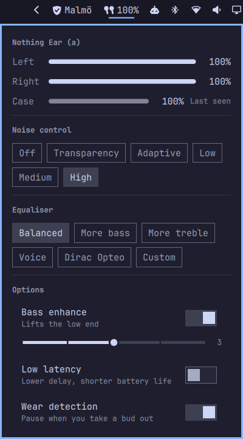

# Nothing Audio Control Plugin for Omarchy

A widget for Nothing and CMF earbuds in the Omarchy bar: per-earbud and case
battery, noise control, equaliser presets, bass enhance, low latency and wear
detection. Talks to the earbuds directly over Bluetooth RFCOMM — no daemon, no
external CLI, nothing to install.



Plugin id: `pinta365.nothing-control`. Status: in development.

## Device support

A device is in one of three states, and gets exactly what that state has
established — nothing that is guessed.

- **Verified** — mapped id by id against the Nothing X app.
- **Identified** — recognised, with some values confirmed and others not. This
  is what a local mapping produces.
- **Unidentified** — not recognised, so only the parts that are the same across
  every implementation surveyed.

| | verified | identified | unidentified |
| --- | --- | --- | --- |
| Battery, noise control | yes | yes | yes |
| Low latency, wear detection | yes | yes | yes |
| Equaliser | yes | confirmed presets only | **hidden** |
| Bass enhance | yes | **hidden** | **hidden** |

**Verified:** Nothing Ear (a) — `B162`.

Equaliser ids and the bass encoding are genuinely per model. CMF uses a
different preset set entirely, and the bass `level * 2` encoding is known to
apply to only some model bases. A device we have not confirmed would accept
those writes and apply something other than the label says, so those controls
stay hidden rather than lie.

If your device is not verified, the panel offers **Help us add support** or
**Help us finish support**. The guided flow sweeps every read-only opcode, then
asks you to select each equaliser preset in Nothing X, name it, and reads its raw
id back after you close the app. The names are yours to give, so a device whose
presets differ from Nothing's -- CMF's, for instance -- maps just the same. It produces one redacted report and only opens an issue
if you agree. It can also apply what you confirmed as a local hotfix, without
waiting for a release. The device-info block is redacted first because it
carries your serial number and Bluetooth address. You can run it directly too:

```sh
./tools/map-device.sh
```

Mapping the equaliser is optional: decline it and the run is a plain device
report, which is enough to get a model added.

The hotfix offers only the presets you confirmed; the rest stay hidden, as does
bass enhance, because its `level * 2` write encoding is model-specific and the
mapping flow cannot establish it.

To go further and ship support for your device, by hand or with a coding agent,
see [docs/adding-a-device.md](docs/adding-a-device.md).

## Design

**Short-lived RFCOMM sessions, not a daemon.** Only one program may hold the
Nothing control channel. A resident daemon makes this widget a permanent
contender for it and locks out every other Nothing tool — which is why
a resident daemon has to be stopped before any other tool can talk to the
earbuds at all. Opening, asking and closing costs about a second and leaves the
channel free.

**Event-driven, not polled.** Refreshes are triggered by `Quickshell.Bluetooth`
connect/battery signals. A closed panel costs nothing.

**Live while you are looking.** The earbuds push a frame whenever something is
changed on the device itself, so while the panel is open the helper holds the
channel and streams changes as they happen — a pinch shows up immediately, with
no polling. That channel is single-occupancy, so the watch is bounded, released
the moment the panel closes, and stood down before any write. No other Nothing
plugin does this.

**Degrades rather than disappears.** If the control channel is busy, the widget
falls back to the BlueZ aggregate battery and says so.

```
manifest.json          plugin manifest and settings schema
Panel.qml              bar item and popup
Service.qml            session lifecycle, state, optimistic actions
Model.js               parsing and formatting -- no QML imports, unit tested
NothingEarIcon.qml     drawn earbud silhouette
helper/nothing_ear.py  RFCOMM client, stdlib only
tools/map-device.sh    probe, optional equaliser mapping, report, local hotfix
tests/                 deno test over Model.js, unittest over the protocol
docs/                  contributing guide and how to add a device
```

## Install

```sh
omarchy plugin add https://github.com/Pinta365/omarchy-nothing-control --enable
```

Requires `bluez`, `bluez-utils`, and the earbuds paired normally. No packages
to install: the helper is standard library only.

The low battery warning is sent with `notify-send`, from `libnotify`. The
mapping tool can file its report with the GitHub CLI (`gh`) and prints the issue
link instead when it is missing. Everything else it calls ships with Omarchy.

It must be invoked as **`/usr/bin/python3`**, never bare `python3`. Version
managers (mise, pyenv, asdf) generally build CPython without Bluetooth socket
support, so `socket.BTPROTO_RFCOMM` is simply absent there and the helper
cannot open a connection at all.

## Remove

```sh
omarchy plugin remove pinta365.nothing-control
```

That disables the plugin and deletes its folder, including any local device
mapping. The only thing left behind is the last case battery reading, kept in
`~/.local/state/nothing-control/`; delete that folder too for a clean removal.

## Development

```sh
./tools/dev.sh             # sync into ~/.config/omarchy/plugins/ and validate
./tools/dev.sh --restart   # ...and restart the shell (needed for structural changes)

deno test --allow-read tests/                    # parsing and formatting
/usr/bin/python3 -m unittest discover -s tests   # wire protocol
```

The shell watches `~/.config/omarchy/plugins` and hot-reloads QML edits on its
own, but that only re-evaluates the QML. Anything structural — a new property,
a new IPC method, a changed implicit size — needs `--restart` to take effect.
A change that appears to do nothing is usually this.

Run the helper on its own to debug the protocol without the shell in the way:

```sh
/usr/bin/python3 helper/nothing_ear.py status
/usr/bin/python3 helper/nothing_ear.py set-anc transparency
/usr/bin/python3 helper/nothing_ear.py set-eq more_bass
/usr/bin/python3 helper/nothing_ear.py set-bass 3          # or: off
/usr/bin/python3 helper/nothing_ear.py set-latency on      # or: off
/usr/bin/python3 helper/nothing_ear.py set-in-ear on       # or: off

/usr/bin/python3 helper/nothing_ear.py watch --seconds 30  # stream changes
/usr/bin/python3 helper/nothing_ear.py listen --seconds 30 # dump raw events
```

Only one program may hold the control channel, so `status` reports
`errorCode: "busy"` while the panel is open and streaming. That is the
degradation path working, not a failure.

## Protocol

RFCOMM channel 15, service `aeac4a03-dff5-498f-843a-34487cf133eb`. Frames are
little-endian:

```
0x55 | ctrl u16 = 0x0160 | opcode u8 | direction u8 | len u16 | seq u8 | payload | crc16 u16
```

CRC is polynomial `0xA001`, init `0xFFFF`, over the whole frame including the
start byte. Those are CRC-16/MODBUS parameters despite the name `crc16_arc`
used elsewhere; `crc16(b"123456789") == 0x4B37` pins it.

The control word is three fields rather than a constant: `0x0F00` device type
(1 = TWS headset), `0x40` frame is sequenced, `0x20` a CRC trailer follows.
So `0x0160` means "TWS headset, sequenced, CRC present".

Direction is `0xC0` get, `0xF0` set, `0x40` response, `0x70` ack, `0xE0` a
pushed event. **Opcode bytes are reused across features**, so messages must be
keyed on the `(opcode, direction)` pair: `0x02` is find-my as a SET and
case-closed as an event.

The encoder is verified byte-for-byte, CRC included, against a packet captured
from real hardware.

### Traps worth knowing

- **Pushed event frames carry no CRC.** Their control word is `0x0100`, so the
  `0x20` bit is clear. Test that bit per frame; assuming a trailer mis-frames
  them and desyncs the stream.
- **EQ preset ids are per model.** On Ear (a) (B162), verified against the
  Nothing X app: `0` balanced, `1` voice, `2` more treble, `3` more bass,
  `4` **Dirac Opteo**, `5` custom. Other implementations transpose `voice`
  with `more_bass` and place `custom` at 4. Id 4 is a working profile the
  official app will not let you select.
- **Bass enhance is a pair, not a level**: `[enabled, level * 2]`, level 0-5.
  A one-byte payload is accepted without complaint and sets nonsense.
- **Low latency is 1 for on and 2 for off**, not 0.
- **Noise control mode and strength are orthogonal.** The wire enum skips 6:
  `1` high, `2` mid, `3` low, `4` adaptive, `5` off, `7` transparency.
- **The case only reports while its lid is open.** Cache the last reading,
  flag it stale, and never show a stale reading as charging.
- **Never write the device codec (`0x29`).** The firmware acknowledges values
  it does not apply. Real codec changes are host-side, via PipeWire.
- A **wrong RFCOMM channel fails silently** — the link opens and the buds
  never answer. The test for a correct channel is a battery query returning
  data, not `connect()` succeeding.

A round trip proves none of this: setting a value and reading it back returns
the number you wrote, so it only confirms the code agrees with itself. Every
semantic claim above was checked against an external oracle — the phone app,
a packet capture, or a second independent implementation.

## Not implemented

Custom and graphic EQ (the payload has no primary source and needs a capture
first), find-my, codec switching, gesture remapping, fit test. The protocol
layer makes each of these small additions.

Most of the wear-detection settings block is also unmapped: the reply carries
nine `(key, value)` pairs and only key `0x01` is identified. The rest are
carried through in `inEar.flags` so they can be named later without another
capture.
